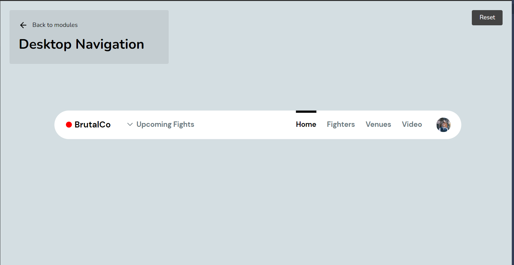

# 🖍 Figma basics

New -> design file to create an empty draft\

### Tools

#### **Frame tool**&#x20;

creates a "canvas" with presets, width and height can be changed&#x20;

#### Text

2 ways to add type (no difference between them):

* Click "t" button and start typing
* Click "t" button and left-click and drag

### Keyboard keys

* ctrl + d - duplicates
* ctrl + g - groups
  * double click - access element in a group&#x20;
* shift while holding - moves element on a straight line
* shift + r - show rules
  * left click and drag on ruler to create a red helper line
* space to switch between hand cursor and pointer
